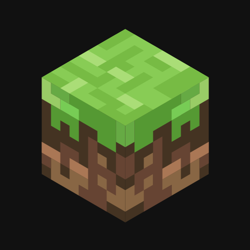
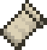
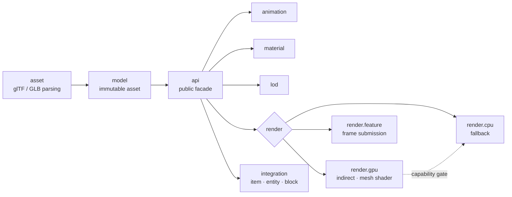

<div align="center">


**High-performance glTF 2.0 rendering for Minecraft · Fabric**

<br/>

<a href="https://www.khronos.org/gltf/"></a>&nbsp;&nbsp;&nbsp;&nbsp;
<a href="https://www.vulkan.org"></a>&nbsp;&nbsp;&nbsp;&nbsp;
<a href="https://www.opengl.org"></a>&nbsp;&nbsp;&nbsp;&nbsp;
<a href="https://www.minecraft.net"></a>&nbsp;&nbsp;&nbsp;&nbsp;
<a href="https://fabricmc.net"></a>&nbsp;&nbsp;&nbsp;&nbsp;
<a href="https://irisshaders.dev"></a>&nbsp;&nbsp;&nbsp;&nbsp;
<a href="https://kotlinlang.org"></a>

<br/>

**English** · [简体中文](README.zh-CN.md)

</div>

---

> [!NOTE]
> **libgltf** is a rendering *library*, not a content mod. Other mods call its API to attach animated, PBR-textured glTF 2.0 models to **items, entities and block entities** — rendered natively inside Minecraft's modern Vulkan / OpenGL pipeline.

## Highlights

| Feature | Detail |
|---|---|
| **glTF 2.0 / GLB** | Meshes, node hierarchies, skins, PBR materials, `OPAQUE` / `MASK` / `BLEND` |
| **GPU-driven (Vulkan)** | Compute-shader instance & meshlet frustum culling → `vkCmdDrawIndexedIndirectCount` |
| **Mesh shaders** | Optional `VK_EXT_mesh_shader` task/mesh pipeline with automatic fallback chain |
| **Instancing & skinning** | Bone palettes streamed via triple-buffered `MappableRingBuffer`, zero cross-frame races |
| **Animation** | Clip playback, blending, parameterized state machine with conditions & transitions |
| **LOD** | meshoptimizer-generated LOD chains, configurable selection policies |
| **True transparency** | Mojang `VertexSorting`-based per-face sorting for `BLEND` materials |
| **Iris compatible** | Dedicated OpenGL pipeline mapping when shader packs are enabled |

> [!TIP]
> No capable GPU? No problem. libgltf probes device capabilities at startup and transparently falls back **mesh shader → indirect → direct → CPU**, so the same code runs everywhere.

## Quick start

```kotlin
val api: GltfApi = LibGltf.api

val asset = (api.load(Path.of("models/drone.glb")) as GltfLoadSuccess).asset
val instance = api.createInstance(api.upload(asset))

instance.animator.play("Start_Liftoff")
instance.setPosition(0f, 64f, 0f)
api.register(instance)
```

Attach to game objects with one line:

```kotlin
GltfRenderers.item(instance)
GltfRenderers.block(instance)
GltfRenderers.entity(context, provider)
GltfRenderers.blockEntity(provider)
```

<details>
<summary><b>Per-instance control — render mode, LOD, material remapping</b></summary>

```kotlin
instance.renderMode = GltfRenderMode.GPU_PREFERRED
instance.lodPolicy = LodPolicy.DEFAULT
instance.remapMaterial("Body", "BodyDamaged")
instance.setMaterial(0, MaterialOverride(...))
instance.automaticAnimation = false
```

</details>

## Architecture



<details>
<summary><b>Package layout</b></summary>

| Package | Responsibility |
|---|---|
| `api` | Public facade: loading, handles, instances, render mode |
| `asset` | glTF / GLB parsing and buffer decoding |
| `model` | Immutable asset model (nodes, meshes, skins) |
| `material` | PBR materials and per-instance overrides |
| `animation` | Players, controllers, state machines |
| `lod` | LOD generation and selection |
| `render.cpu` / `render.gpu` / `render.feature` | CPU fallback, GPU resources, frame submission |
| `integration` | Item / entity / block-entity renderers |
| `mixin` | Minimal Java mixins for Vulkan & Iris integration |

</details>

## Building

```powershell
.\gradlew.bat build
```

Output → `build/libs/libgltf-0.01-fabric.jar`

> [!IMPORTANT]
> Requires Minecraft **26.2**, Fabric Loader **0.19.3+**, Fabric API, Fabric Language Kotlin and Java **25**.
> The mesh-shader path additionally needs a Vulkan device exposing `VK_EXT_mesh_shader`.

---

<div align="center">

MIT © Micheanl Chen

</div>
