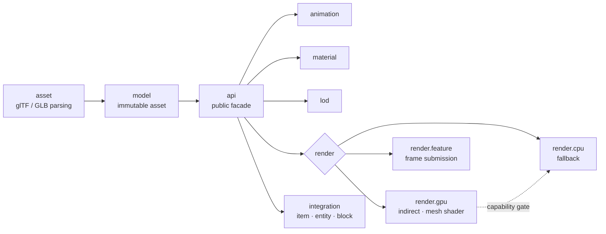
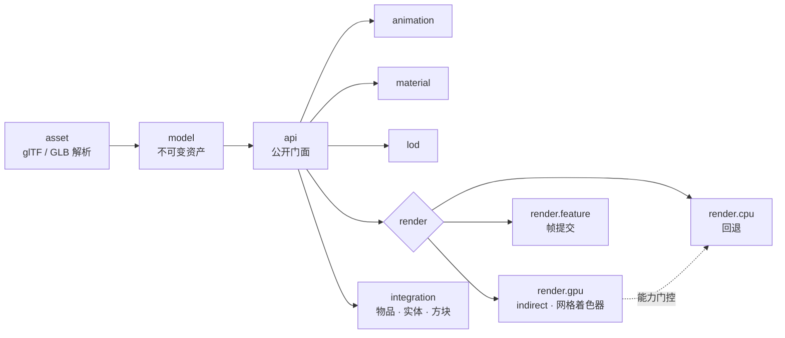

<div align="center">


**High-performance glTF 2.0 rendering for Minecraft · Fabric**

为 Minecraft 打造的高性能 glTF 2.0 模型加载与渲染引擎


<br/>

<a href="https://www.khronos.org/gltf/"></a>&nbsp;&nbsp;&nbsp;&nbsp;
<a href="https://www.vulkan.org"></a>&nbsp;&nbsp;&nbsp;&nbsp;
<a href="https://www.opengl.org"></a>&nbsp;&nbsp;&nbsp;&nbsp;
<a href="https://www.minecraft.net"></a>&nbsp;&nbsp;&nbsp;&nbsp;
<a href="https://fabricmc.net"></a>&nbsp;&nbsp;&nbsp;&nbsp;
<a href="https://irisshaders.dev"></a>&nbsp;&nbsp;&nbsp;&nbsp;
<a href="https://kotlinlang.org"></a>

<br/>

**[English](#english)** · **[中文](#中文)**

</div>

---

## English

> [!NOTE]
> **libgltf** is a rendering *library*, not a content mod. Other mods call its API to attach animated, PBR-textured glTF 2.0 models to **items, entities and block entities** — rendered natively inside Minecraft's modern Vulkan / OpenGL pipeline.

### Highlights

| Feature | Detail |
|---|---|
| **glTF 2.0 / GLB** | Meshes, node hierarchies, skins, PBR materials, `OPAQUE` / `MASK` / `BLEND` |
| **GPU-driven (Vulkan)** | Compute-shader instance & meshlet frustum culling → `vkCmdDrawIndexedIndirectCount` |
| **Mesh shaders** | Optional `VK_EXT_mesh_shader` task/mesh pipeline with automatic fallback chain |
| **Instancing & skinning** | Bone palettes streamed via triple-buffered `MappableRingBuffer`, zero cross-frame races |
| **Animation** | Clip playback, blending, parameterized state machine with conditions & transitions |
| **LOD** | meshoptimizer-generated LOD chains, configurable selection policies |
| **True transparency** | Mojang `VertexSorting`-based per-face sorting for `BLEND` materials |
| **Iris compatible** | Dedicated OpenGL pipeline mapping when shader packs are enabled |

> [!TIP]
> No capable GPU? No problem. libgltf probes device capabilities at startup and transparently falls back **mesh shader → indirect → direct → CPU**, so the same code runs everywhere.

### Quick start

```kotlin
val api: GltfApi = LibGltf.api

val asset = (api.load(Path.of("models/drone.glb")) as GltfLoadSuccess).asset
val instance = api.createInstance(api.upload(asset))

instance.animator.play("Start_Liftoff")
instance.setPosition(0f, 64f, 0f)
api.register(instance)
```

Attach to game objects with one line:

```kotlin
GltfRenderers.item(instance)
GltfRenderers.block(instance)
GltfRenderers.entity(context, provider)
GltfRenderers.blockEntity(provider)
```

<details>
<summary><b>Per-instance control — render mode, LOD, material remapping</b></summary>

```kotlin
instance.renderMode = GltfRenderMode.GPU_PREFERRED
instance.lodPolicy = LodPolicy.DEFAULT
instance.remapMaterial("Body", "BodyDamaged")
instance.setMaterial(0, MaterialOverride(...))
instance.automaticAnimation = false
```

</details>

### Architecture



<details>
<summary><b>Package layout</b></summary>

| Package | Responsibility |
|---|---|
| `api` | Public facade: loading, handles, instances, render mode |
| `asset` | glTF / GLB parsing and buffer decoding |
| `model` | Immutable asset model (nodes, meshes, skins) |
| `material` | PBR materials and per-instance overrides |
| `animation` | Players, controllers, state machines |
| `lod` | LOD generation and selection |
| `render.cpu` / `render.gpu` / `render.feature` | CPU fallback, GPU resources, frame submission |
| `integration` | Item / entity / block-entity renderers |
| `mixin` | Minimal Java mixins for Vulkan & Iris integration |

</details>

### Building

```powershell
.\gradlew.bat build
```

Output → `build/libs/libgltf-0.01-fabric.jar`

> [!IMPORTANT]
> Requires Minecraft **26.2**, Fabric Loader **0.19.3+**, Fabric API, Fabric Language Kotlin and Java **25**.
> The mesh-shader path additionally needs a Vulkan device exposing `VK_EXT_mesh_shader`.

---

## 中文

> [!NOTE]
> **libgltf** 是一个渲染*库*，不是内容模组。其他模组通过 API 即可为**物品、实体、方块实体**挂载带动画与 PBR 材质的 glTF 2.0 模型，并在 Minecraft 现代 Vulkan / OpenGL 管线中原生渲染。

### 亮点

| 特性 | 说明 |
|---|---|
| **glTF 2.0 / GLB** | 网格、节点层级、蒙皮、PBR 材质，完整支持 `OPAQUE` / `MASK` / `BLEND` |
| **GPU 驱动（Vulkan）** | compute shader 实例与 meshlet 视锥剔除 → `vkCmdDrawIndexedIndirectCount` |
| **网格着色器** | 可选 `VK_EXT_mesh_shader` task/mesh 管线，自动逐级回退 |
| **实例化与蒙皮** | 骨骼调色板经三缓冲 `MappableRingBuffer` 流式上传，无跨帧竞争 |
| **动画系统** | 剪辑播放、混合，带参数、条件与过渡的动画状态机 |
| **LOD** | meshoptimizer 生成的 LOD 链，选择策略可配置 |
| **正确透明** | 基于 Mojang `VertexSorting` 的 `BLEND` 材质逐面排序 |
| **Iris 兼容** | 开启光影时使用专用 OpenGL 管线映射 |

> [!TIP]
> 设备不给力？没关系。libgltf 启动时探测设备能力，透明地按 **网格着色器 → indirect → direct → CPU** 逐级回退，同一份代码到处能跑。

### 快速开始

```kotlin
val api: GltfApi = LibGltf.api

val asset = (api.load(Path.of("models/drone.glb")) as GltfLoadSuccess).asset
val instance = api.createInstance(api.upload(asset))

instance.animator.play("Start_Liftoff")
instance.setPosition(0f, 64f, 0f)
api.register(instance)
```

一行挂载到游戏对象：

```kotlin
GltfRenderers.item(instance)
GltfRenderers.block(instance)
GltfRenderers.entity(context, provider)
GltfRenderers.blockEntity(provider)
```

<details>
<summary><b>实例级控制 — 渲染模式、LOD、材质重映射</b></summary>

```kotlin
instance.renderMode = GltfRenderMode.GPU_PREFERRED
instance.lodPolicy = LodPolicy.DEFAULT
instance.remapMaterial("Body", "BodyDamaged")
instance.setMaterial(0, MaterialOverride(...))
instance.automaticAnimation = false
```

</details>

### 架构



<details>
<summary><b>包结构</b></summary>

| 包 | 职责 |
|---|---|
| `api` | 公开门面：加载、句柄、实例、渲染模式 |
| `asset` | glTF / GLB 解析与缓冲解码 |
| `model` | 不可变资产模型（节点、网格、蒙皮） |
| `material` | PBR 材质与实例级覆盖 |
| `animation` | 播放器、控制器、状态机 |
| `lod` | LOD 生成与选择 |
| `render.cpu` / `render.gpu` / `render.feature` | CPU 回退、GPU 资源、帧提交 |
| `integration` | 物品 / 实体 / 方块实体渲染器 |
| `mixin` | Vulkan 与 Iris 集成所需的最小 Java Mixin |

</details>

### 构建

```powershell
.\gradlew.bat build
```

产物 → `build/libs/libgltf-0.01-fabric.jar`

> [!IMPORTANT]
> 需要 Minecraft **26.2**、Fabric Loader **0.19.3+**、Fabric API、Fabric Language Kotlin 与 Java **25**。
> 网格着色器路径额外需要支持 `VK_EXT_mesh_shader` 的 Vulkan 设备。

---

<div align="center">

MIT © Micheanl Chen

</div>
